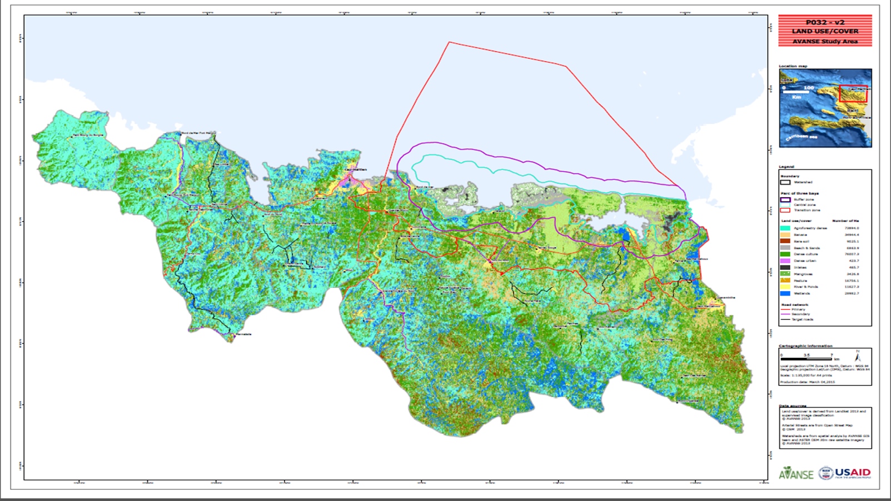

# Maps and Data Repository for AVANSE's GIS Team
These maps were developed by HAITI AVANSE's GIS Team: Emmanuel Pierre and Dawine Pierre

## Project Area

## Land Cover Map from the Programmatic Environmental Assessment

##  System Pumps
![LOCALISATION SYSTEM] (/maps/localisation_systeme_pompage/localisation_systeme_pompage.jpg)

## Sample Zones
![zones prélèvement] (/maps/zones_prelevement_sols_IR1/zones_prelevement_sols_IR1_LT_150212.jpg)
